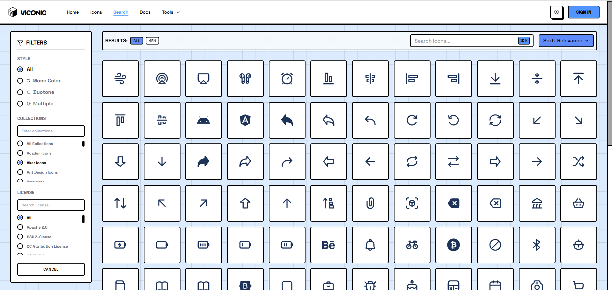

# VICONIC-SVG
[](https://www.viconic.dev)

**200,000+ open-source SVG icons from 230+ collections, organized and ready to use.**

## 🚀 Recommended: Use Online

[](https://www.viconic.dev/search)

Visit **[viconic.dev](https://viconic.dev)** for the best experience:

- 🔍 **Instant Search** - Find icons across 200,000+ icons in milliseconds
- 📋 **One-Click Copy** - HTML, React, SVG, or CDN code
- 🎨 **Live Preview** - Test colors, sizes, and styles
- � **Custom Kits** - Create project-specific icon collections
- ⚡ **Global CDN** - Fast delivery worldwide
- �️ **SVhG Editor** - Edit and optimize SVGs in browser

## 📦 Alternative: Install via NPM

```bash
npm install viconic-react-icons
```

```jsx
import { ViconicIcon } from "viconic-react-icons";

<ViconicIcon name="ti:home" size={24} color="blue" />
```

## 🌐 Alternative: Use CDN

```html
<script src="https://cdn.viconic.dev/js/copyicons-smart-loader.min.js"></script>
<viconic-icon icon="ti:home"></viconic-icon>
```

## 📁 Repository Structure

```
viconic-svg/
└── assets/
    ├── tabler_icons/
    │   ├── info.json       # Metadata & license info
    │   └── svg/            # SVG files
    ├── lucide/
    ├── heroicons/
    └── ... (230+ collections)
```

## 📄 Collection Metadata

Each `info.json` contains:

```json
{
  "prefix": "ti",
  "info": {
    "name": "Tabler Icons",
    "url": "https://tabler-icons.io",
    "total": 4000,
    "author": {
      "name": "Paweł Kuna",
      "url": "https://github.com/tabler/tabler-icons"
    },
    "license": {
      "title": "MIT License",
      "spdx": "MIT",
      "url": "https://opensource.org/licenses/MIT"
    }
  }
}
```

## 🎯 Popular Collections

- **Tabler Icons** (6,080) MIT
- **Lucide** (1,703) ISC
- **Heroicons** (1288) MIT
- **Bootstrap Icons** (2,080) -By Bootstrap, MIT
- **Font Awesome** (2,000+) - Most popular, Multiple licenses
- **Material Design Icons** (7,000+) - Google, Apache 2.0
- **Feather Icons** (280+) - Simply beautiful, MIT

**+ 223 more collections!**

## 📖 Documentation

- **Website**: [viconic.dev](https://viconic.dev)
- **Docs**: [viconic.dev/docs](https://viconic.dev/docs)
- **Search**: [viconic.dev/search](https://viconic.dev/search)
- **Collections**: [viconic.dev/icons](https://viconic.dev/icons)

## 📄 Licenses

Each collection has its own license (MIT, Apache 2.0, CC BY 4.0, etc.). Always check `info.json` before using icons commercially.

## 🤝 Contributing

Want to add collections or report issues?

- **Contact**: [viconic.dev/contact](https://viconic.dev/contact)
- **Email**: hello@viconic.dev

## 🌐 Connect

- [Facebook](https://www.facebook.com/profile.php?id=61579497105773)
- [Twitter/X](https://x.com/ViconicIcons)
- [Instagram](https://www.instagram.com/viconicicons/)

## ⚡ Why VICONIC?

**For Developers:**
- Fast CDN integration
- Framework agnostic (React, Vue, Angular, etc.)
- Tree-shakeable NPM package
- TypeScript support

**For Designers:**
- Massive selection (200,000+ icons)
- Built-in SVG editor
- Export to multiple formats
- Easy organization with Kits

**For Teams:**
- Shared icon libraries (Kits)
- Consistent CDN links
- Usage tracking
- Collaboration features

## 💡 Pro Tip

**Don't clone this repo unless you need offline access.** Use [viconic.dev](https://viconic.dev) for instant access, better search, and automatic updates.

---

**Made with ❤️ by VICONIC**  
© 2026 viconic.dev
